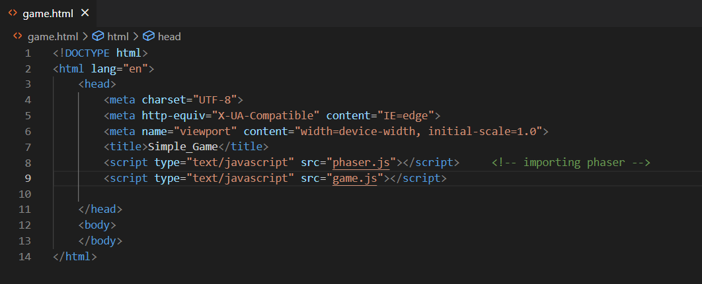

# آموزش راه اندازی و ساخت یک پروژه با فریمورک فیزر  

در این قسمت میخواهیم به شما راه اندازی فریم ورک فیزر را آموزش دهیم و یک پروژه ساده بالا بیاوریم . پروژه و منابع مورد نیاز نیز در گیت هاب آمده است. همچنین لازم به ذکر است که ما اینجا با فیزر 3 کار میکنیم. (فیزر 2 سینتکس های جداگانه دارد و قدیمی تر است.)

- [نصب وب سرور](#نصب_وب_سرور)
- [دانلود فیزر](#دانلود_فیزر)
- [راه اندازی یک پروژه ساده](#راه_اندازی_یک_پروژه_ساده)

# نصب وب سرور
قبل از اینکه شروع به  کار با فیزر کنید ، شما نیاز به یک وب سرور دارید، این نیاز به دلیل مسائل امنیتی و دسترسی به فایل های دستگاه شما است. برای ویندوز به شما `wampserver`  و برای سیستم عامل های unixbased به شما `mamp` را معرفی میکنم. 

# دانلود فیزر
برای دانلود فیزر به این [آدرس](https://web.archive.org/web/20230324155035/http://phaser.io/download/stable) مراجعه کنید ، شما میتوانید نسخه کوچک شده ی js را دانلود کنید اما اگر میخواهید که بدنه ی تابع های فیزر را ببینید تا دید بهتری بیابید ، نسخه کامل js آن را دانلود کنید. برای نصب فیزر به قسمت داک فیزر این تحقیق مراجعه کنید.

# راه اندازی یک پروژه ساده
ابتدا پوشه اصلی بازی خود را میسازیم ، درون آن ، فایل html جدیدی ایجاد میکنیم و بیسیک های یک فایل html را ایجاد میکنیم. سپس درون  تگ head آن ، دو فایل js را ایمپورت میکنیم ، اولین فایل ، همان فایل js فیزر است که دانلود کردیم . دومین فایل را خودمان ایجاد میکنیم که در آن کانفیگ بازی خود را مینویسیم ، من این فایل را game.js نام گذاری کردم. تا الان ساختار پروژه ما به شکل زیر است:

در فایل game.js شروع به ساخت یک آبجکت Game میکنیم و آن را کانفیگ میکنیم:

در قسمت کانقیگ به آن اندازه طول و عرض پنجره بازی خود ، رنگ پس زمینه را میدهیم. در فیزر ما میتوانیم صحنه های مختلفی نمایش دهیم و بین آنها switch کنیم ،در آرایه ی جلوی صحنه همه ی صحنه هایی که قصد دارید در بازی خود نشان دهید را بنویسید ، گیم ما فقط یک صفحه دارد. در قسمت بعد نیز مشخصات فیزیک مورد استفاده را نوشتیم. پس از انجام کانفیگ آبجکت گیم خود را ایجاد کردیم.

حال در پوشه پروژه اصلی یک فایل js به نام Scene1.js ایجاد میکنیم ، در فایل html خود ، آن را در خط  بالای جایی که game.js را ایمپورت کردیم ایمپورت میکنیم زیرا باید قبل از آن باشد تا game.js بتواند از آن رفرنس بگیرد. در فایل Scene1.js کلاس صحنه را extend میکنیم به شکل زیر:

حال به وب سرور خود رفته و فایل html خود را اجرا کنید ، صفحه زیر را مشاهده خواهید کرد:

قبل از اینکه شروع به نوشتن منطق خود بکنیم ، فولدر assets را به پروژه اضافه میکنیم که در آن عکس های مورد نیاز پروژه ما وجود دارند.

حال شما باید سه تابع در کلاس scene آشنا شوید:
 
`preload`:
 
در این تابع که قبل از بقیه تابع ها اجرا میشود شما عکس ها و منابعی که نیاز دارید در بازیتان استفاده کنید را لود میکنید.
 
`create`:
 
این تابع حالت init دارد و شما آبجکت های خود را برای بار اول در این تابع ایجاد میکنید و برای آنها منطق کلی مینویسید، به طور مثال شما در این قسمت شخصیت بازی خودتان را ایجاد میکنید و برای آن ویژگی های فیزیکی و interaction های موجود بین آن و محیط بازی خود را تعریف میکنید..
 
`update`:
 
این تابع به صورت مکرر و پشت سر هم اجرا میشود و برای آپدیت کردن وضعیت بازی است ، مثلا اضافه کردن امتیاز یا حرکت کردن با فشردن arrow key ها.

حال شروع به نوشتن منطق میکنیم:

چهار متغیر platforms , cursors . score , score_text را ایجاد میکنیم و بعدا با آنها کار داریم، در قسمت preload عکس های خود را لود  میکنیم، این عکس ها با نام داده شده در آرگومان اول تابع لود به صورت فیلد در this(window) ذخیره میشوند. عکس های بازیکن ما به شکل spritesheet است و باید سایز هر قطعه مشخص شود.

در قسمت create ما آبجکت های خود را ایجاد و نمایش میدهیم ، ابتدا یک پس زمینه برای بازی قرار میدهیم، توجه داریم که فیزر مانند بقیه گیم فریم وورک ها کار نمیکند و نقطه وسط تصویر را به عنوان مبدا میگیرد و برای تغییر آن به گوشه بالا سمت چپ از set origin استفاده میکنیم.

 

یک تکست برای امتیاز ایجاد میکنیم که آن را بعدا در قسمت update بروز رسانی میکنیم.

یک سری مانع را در گروهی به نام platforms ایجاد میکنیم که شخصیت بازی بتواند بر روی آنها حرکت کند و نیفتد تابع setscale اندازه ی آن مانع را نسبت به عکس داده شده مشخص میکند. تابع refreshbody نیز دیفالت های فیزیکی یک جسم را به آن آبجکت میدهد. آروگومان های تابع، مختصات ایجاد شی و imageی است که نیاز داریم.

پس از آن player خود را ایجاد میکنیم و به آن قابلیت bounce میدهیم. برای اینکه از صفحه ما خارج نشود ، setcolliderworldbounds را فعال میکنیم. بین platform ها و پلیر خود نیز collider ایجاد میکنیم تا پلیر از بازی به پایین نیفتد.

حال میخواهیم به آن قابلیت حرکت کردن و پرش بدهیم:

در ابتدا کلید های کیبرد را را گرفته و در cursors ذخیره میکنیم، سپس میخواهیم سه انیمیشن ایجاد کنیم. حرکت به راست ، حرکت به چپ و حالت ایستاده، برای هر انیمشین ، فریم های مربوطه را از spritesheet به آن میدهیم و  framerate  را مقدار دهی کرده و repeat را روی -1 میگذاریم که بینهایت اجرا شود.

حال برای حرکت کردن به تابع Update میرویم تا بتوانیم حرکت را کنترل کنیم:

با چند if statement ساده حرکت را کنترل میکنیم بدین صورت که اگر کلید راست پایین باشد سرعت مثبت و در چپ منفی و اگر هیچکدام نباشد سرعت 0 شود. همچنین برای پرش سرعتی منفی میدهیم که به معنی پرش است . توجه داریم که تا وقتی که جسم روی زمین نباشد پرش قابل انجام نیست (body.touching.down) بدین صورت حرکت شخصیت خود را کنترل کردیم.

در قسمت آخر میخواهیم یک سری objective به بازی اضافه کنیم ، بدین منظور یک سری ماهی اضافه میکنیم و هر بار که بازیکن به آنها برخورد کرد 10 امتیاز کسب خواهد کرد. در قسمت create کد زیر را اضافه میکنیم:

بدین صورت 10 عدد ماهی را با فاصله 100 از هم درون بازی انداختیم.
برای جذابیت بیشتر bounce آنها را رندوم گذاشتیم تا زیبایی بیشتری داشته باشد. حال باید بین platforms و ماهی ها collider بگذاریم تا ماهی های نیفتند و همچنین با تابع overlap به بازی میفهمانیم که اگر بازیکن به ماهی برخورد کرد به تابع collectfish برود.

تابع collectfish با برخورد به هر ماهی صدا زده میشود ، ابتدا آن ماهی را حذف کرده، 10 امتیاز میدهد و تکست را آپدیت میکند. همچنین در تابع آپدیت چک میکنیم که اگر تمام ماهی ها خورده شد بازی تمام شده و به ما پیام you won بدهد. بدین صورت یک بازی ساده با هم ساختیم. امیدوارم که آموزنده بوده باشد :)

